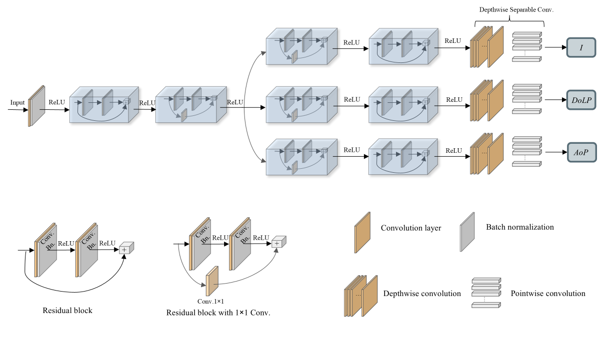
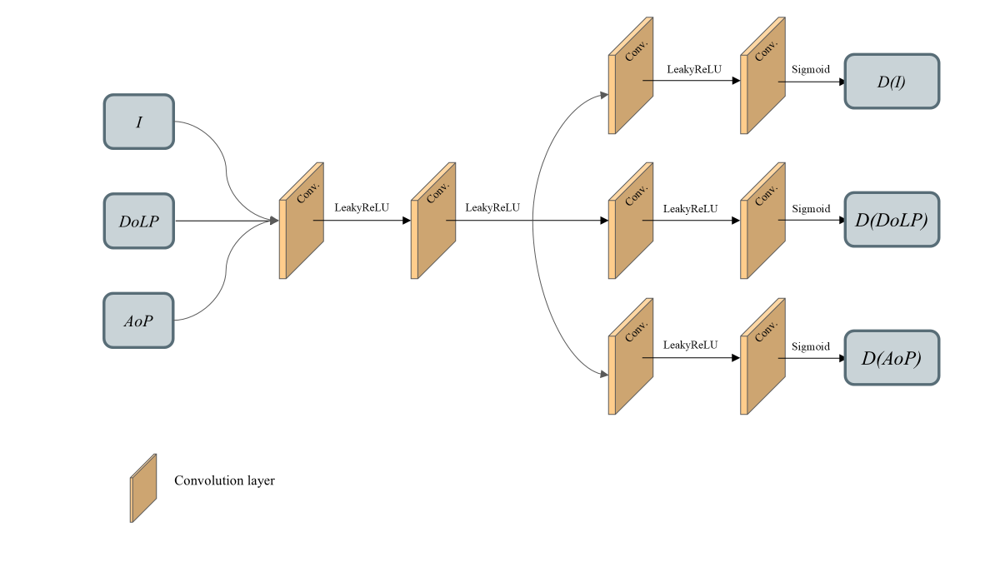

## End-to-end physics-informed multi-branch GAN for enhanced DoFP polarization image reconstruction

## Introduction
This project implements a Generative Adversarial Network (GAN) designed to reconstruct Division-of-Focal Plane (DoFP) polarization images. The network leverages a physics-informed, multi-branch residual architecture to directly reconstruct intensity (I), degree of linear polarization (DoLP), and angle of polarization (AoP) from raw mosaic images. This approach aims to address limitations in spatial resolution and polarimetric accuracy commonly associated with DoFP systems.

## Features
Physics-Informed Losses: Integrates physics-based constraints to enhance reconstruction fidelity.
End-to-end Architecture: Employs residual blocks to handle demosaicking and polarimetric reconstruction concurrently.
Lightweight Model: With only 0.5 million parameters of Generator, the model is optimized for efficient training and deployment across various devices.

## Setup and Notes
1. Place your datasets in the 'data' folder.
2. Put your input images in the 'input' folder.
3. TensorBoard logs will be saved in 'logs' folder.

## How to run
1. Run 'generate_labels.py' to process your dataset.
2. Run 'train.py' to train this model on your dataset.
3. Run 'test.py' to test network on test set.
4. Run 'output_gan.py' to apply the trained model to a raw DoFP image, producing outputs for Intensity (I), Degree of Linear Polarization (DoLP), and Angle of Polarization (AoP).

# Citation
Please cite our work if you use this code in your research.
H. Liu, Z. Gu, S. Shi, Z. Li, X. Lei, Z. Liu, M. Song, J. Yang, C. Li, Z. Zhou, Z. Qiu, and J. Hong, "End-to-end physics-informed multi-branch GAN for enhanced DoFP polarization image reconstruction," Opt. Express 33, 7684-7704 (2025).

# Network Architecture

